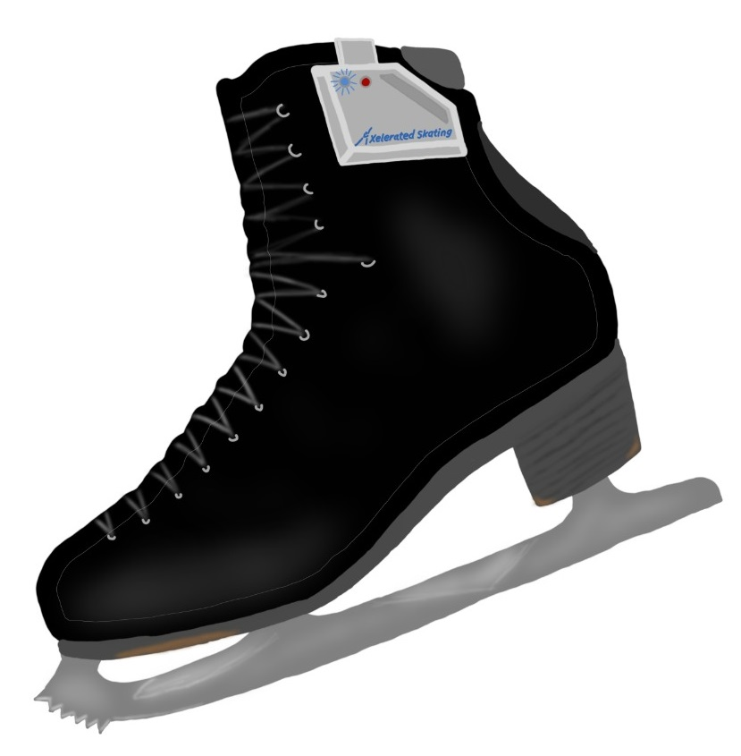

Axel-erated Skating
===
#### An IoT device for Embedded Systems ELEC60013

---

*Developed by: Alexander Limonov, Matei Tanase, Miles Grist, Nikolay Miladinov* 

Figure skaters are exposed to large forces when spinning and landing jumps.
This device aims to provide methods for fast quantitative and qualitative feedback to athletes, when training specific
skating skills; "Axel-erated" progression and monitoring of physical health can be achieved.

It is only within the scope of this project to implement the sensing on a single skate,
however future developments would collect information from both the athlete's skates,
broadening the available analysis of their technique and health.

See below for circuit and system diagrams. 

---

### Implemented Features (*within scope of project*):
1. Jump: peak angular velocity
2. Jump: air time
3. Jump: total rotation
4. Jump: weight distribution (forwards/backwards)
5. Jump: leg stiffness on landing
6. The user saves separate jumps ("events") to the server
7. Statistics for jumps on different days are displayed graphically on a website

---

### Future Scope:
1. Analysis of pushing technique
2. Advice on joint health
3. Total session statistics for both feet
   1. Time spent on each foot
   2. Estimated relative training of each leg
4. Specific analysis for spin technique

---

### System level diagram

---

### Analogue circuit for force sensor interface

---

### Concept of final hardware

